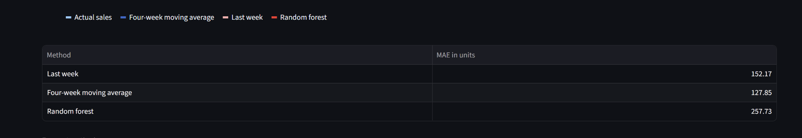
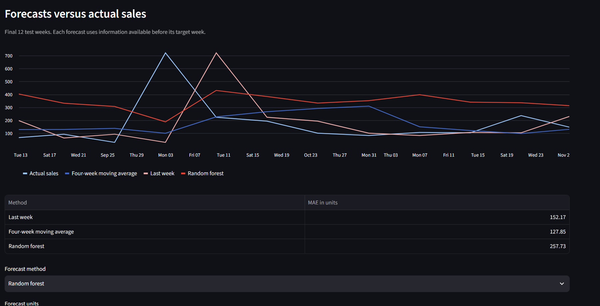

# StockAhead
StockAhead

**Retail demand forecasting and inventory planning with Python and Streamlit.**

StockAhead explores a practical business question: **Which products should a manager prioritise for replenishment next week?** It forecasts weekly sales for 20 products, compares simple baselines with machine learning, and translates forecasts into suggested order quantities using simulated inventory inputs.

> Portfolio prototype using historical transactions. Stock levels, supplier lead times, safety stock and inventory outcomes are simulated. Forecast dates refer to 2011, not current trading conditions.

Dashboard


The dashboard includes:

- Historical weekly sales and actual-versus-predicted charts.
- Next-week forecasts using last week's sales, a four-week moving average or random forest.
- A single-product replenishment calculator with adjustable stock, outstanding orders, lead time and safety stock.
- An editable priority list for all 20 products, using four-week moving-average forecasts.
- Product descriptions alongside product codes.
- Saved priority-table scenario inputs.
- Forecast evaluation and historical inventory scenarios.

The screenshots show different stages of development; the current app also includes product names and the all-product priority list.

Data and cleaning

Source: [UCI Online Retail](https://archive.ics.uci.edu/dataset/352/online+retail), containing 541,909 transaction records from a UK-based online retailer between 1 December 2010 and 9 December 2011.

The original Excel file is preserved. Cleaning removes cancelled invoices, non-positive quantities, non-positive prices and rows missing essential forecasting fields. Fees, postage, vouchers, samples and ambiguous manual entries are excluded from the physical-product forecast target. Alphabetic product codes are reviewed rather than automatically discarded.

The first sequential cleaning pass removed 9,288 cancellation rows, 1,336 additional non-positive-quantity rows and 1,181 additional non-positive-price rows, leaving 530,104 rows before the non-product exclusions. Sequential counts avoid double-counting overlapping issues.

Missing customer IDs are retained because product-level forecasting does not require customer identity. Missing descriptions do not invalidate a product code. Exact duplicate rows are retained because repeated transaction lines have not been verified as errors. Cleaning decisions and removal counts are saved for inspection.

Sales are aggregated into 52 complete Monday–Sunday weeks. Missing product-week observations are filled with zero, meaning **no recorded sales**, rather than confirmed zero customer demand. Partial boundary weeks are excluded.

Twenty products are selected using only the first 32 weeks: activity in at least 70% of those weeks, sales near both ends of that period, and the highest sales volumes among eligible products.

Forecasting and evaluation

Three methods predict weekly units sold:

1. **Last week:** repeat the previous week's sales.
2. **Four-week moving average:** average the previous four weeks.
3. **Random forest:** a pooled model across products using a one-hot encoded product identifier, sales lags of 1, 2, 3, 4 and 8 weeks, four- and eight-week rolling means, four-week rolling standard deviation and target month.

All sales-derived features are shifted so the target week's sales cannot enter its own prediction. The random forest uses 200 trees, maximum depth 8, minimum leaf size 5 and random seed 42.

The chronological split is 32 initial training weeks, 8 validation weeks and 12 final test weeks. The model is refitted for each forecast week using only earlier observations. Previously observed validation or test weeks may enter later training; future weeks remain hidden. Early rows without sufficient lag history are excluded from machine-learning training.

Model settings are frozen before final testing. All methods are evaluated on the same 240 test product-weeks.



### Final test results

- **Last week:** MAE 390.79 units; WAPE 64.46%.
- **Four-week moving average:** MAE 315.14 units; WAPE 51.99%; 19.36% lower MAE than last week.
- **Random forest:** MAE 323.69 units; WAPE 53.40%; 17.17% lower MAE than last week.

Random forest achieved the lowest validation MAE, but the moving average achieved the lowest overall final test MAE. By product, moving average won for 10 products, random forest for 9, and last week for 1. These test-period winners describe performance; they are not used to retrospectively select a model for each test prediction.

**The main finding:** machine learning improved on the last-week baseline, but the simpler moving average performed better overall on unseen test weeks.

MAE measures average absolute error in units. WAPE divides total absolute error by total recorded sales and is influenced more by high-volume products. Product-level results are also provided. Neither metric establishes a guaranteed accuracy level for future periods.



For the final next-week prediction, the model is refitted using all available completed-week history. This does not alter the saved historical test evaluation.

## Inventory planning

The calculator uses a weekly review policy:

```text
Target stock = ceil(forecast × (lead time + 1 review week) + safety stock)
Suggested order = max(0, target stock − stock on hand − outstanding orders)
```

This approximates protection-period demand as constant. The all-product priority list assumes no outstanding orders and ranks products by projected next-week shortage, then suggested order quantity. Ordering now cannot prevent a shortage before the supplier delivery arrives. The single-product calculator subtracts outstanding orders without assessing their individual arrival dates.

The historical simulation receives due orders at the beginning of each week, places a new order, applies recorded sales as simulated demand, and records fulfilled demand, unmet units and closing inventory. An order placed in week `t` with lead time `L` arrives at the start of week `t + L`. Unfulfilled demand is treated as lost sales.

All methods use identical assumptions:

- One-week lead time.
- Initial stock equal to two weeks of each product's average initial-training sales.
- Safety-stock buffers of 0, 0.5, 1 or 2 weeks of that same training average.
- No initial outstanding orders.

At a half-week safety-stock buffer:

- **Last week:** 84.34% fill rate; average closing stock 877.14 units per product.
- **Moving average:** 80.87% fill rate; average closing stock 432.40 units per product.
- **Random forest:** 80.11% fill rate; average closing stock 450.99 units per product.

For moving average, increasing the buffer from zero to two weeks raised fill rate from 73.75% to 93.25%, while average closing stock rose from 307.90 to 939.93 units per product.

These scenarios demonstrate the availability–inventory trade-off. They are exploratory results on the historical test period, not independently validated optimal policies. Average closing stock measures inventory held; it does not prove that those units are excess. No actual cost savings are claimed.

## Run locally

Use a recent Python 3 version compatible with the packages in `requirements.txt`.

```powershell
git clone https://github.com/ma-lawal07/stockahead.git
cd stockahead
python -m venv .venv
.\.venv\Scripts\python.exe -m pip install -r requirements.txt
.\.venv\Scripts\python.exe -m streamlit run app.py
```

Open the local address printed by Streamlit.

The app expects these generated files in `data/processed/`:

- `weekly_history.csv`
- `test_metrics.csv`
- `test_predictions.csv`
- `inventory_scenarios.csv`
- `product_labels.csv`
- `next_week_forecasts.csv`

The priority editor creates `priority_inputs.csv` when a scenario is saved. This file contains local simulated preferences and is excluded from Git.

To regenerate the outputs, download and extract the UCI dataset, place `Online Retail.xlsx` in `data/raw/`, select the project's virtual environment as the notebook kernel, and run `notebooks/exploration.ipynb` from top to bottom. Install `ipykernel` in the environment if it is not already included in the requirements.

## Project structure

```text
stockahead/
├── app.py
├── requirements.txt
├── README.md
├── notebooks/
│   └── exploration.ipynb
├── data/
│   ├── raw/                  # Original dataset; excluded from Git
│   └── processed/            # Generated app data and reports
├── docs/
│   └── images/               # Dashboard screenshots
└── src/                      # Reserved for extracting notebook logic
```

The current analysis pipeline lives in the notebook. The `src` files are scaffolding for future modularisation.

## Limitations and future work

- Recorded sales are not true unconstrained demand: actual stock availability and lost sales are unknown.
- Roughly one year of data is insufficient to establish reliable annual seasonality.
- Results apply to 20 products chosen for sufficient history and sales volume; they may not generalise to intermittent or new products.
- Promotions, supplier reliability, product costs and actual inventory are unavailable.
- Initial stock, lead times and safety stock are simulated, and financial optimisation is outside this prototype's scope.
- Historical scenario comparisons cover only 12 weeks and may be influenced by starting inventory and orders still outstanding at the end.

Future improvements include extracting the notebook pipeline into reusable modules, adding forecast intervals, modelling multiple future weeks explicitly, tracking outstanding-order arrival dates, and evaluating inventory policies against stated costs or service targets.

## Dataset attribution

Chen, D. (2015). *Online Retail* [Dataset]. UCI Machine Learning Repository. [https://doi.org/10.24432/C5BW33](https://doi.org/10.24432/C5BW33).

The dataset is provided under [Creative Commons Attribution 4.0](https://creativecommons.org/licenses/by/4.0/). This attribution describes the dataset licence; it does not assign a licence to this project's code.
